# Homework Submission

**Họ tên:** Phạm Quang Minh

## Các bài đã hoàn thành

- [x] Bài 1: Statistics APIs
### 1.1 Get Assets Statistics
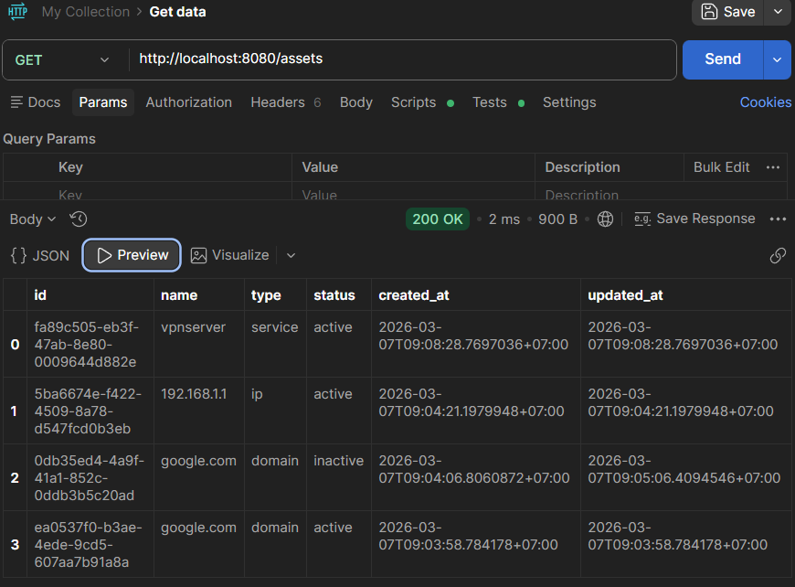

Có 4 assets

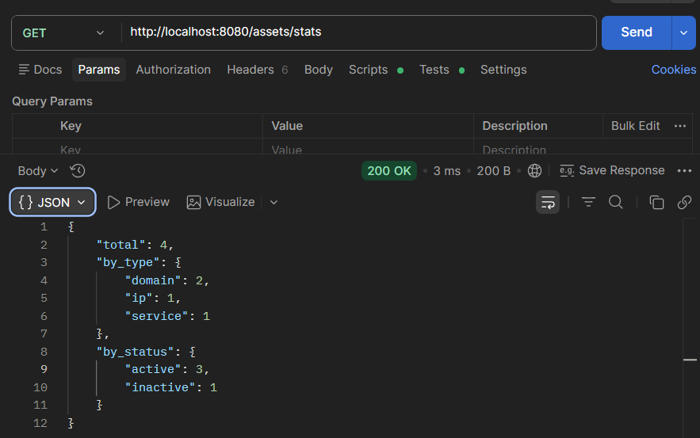

### 1.2 Count Assets by Filter
count
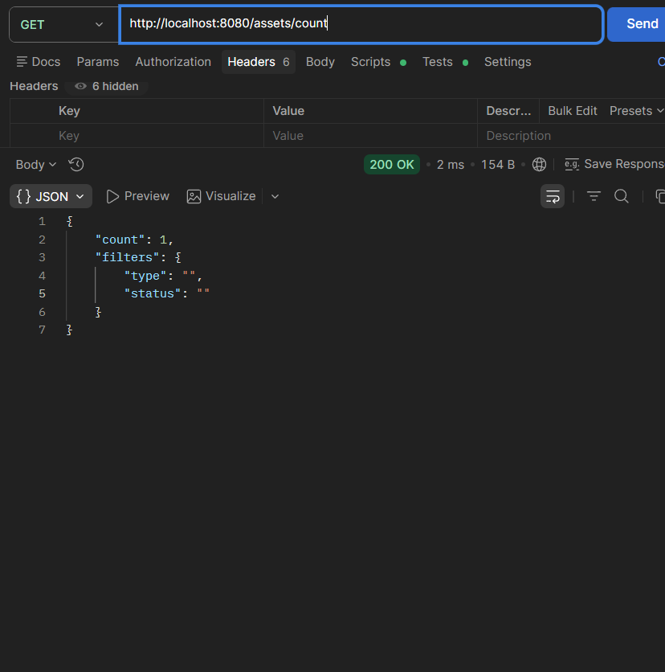

count có type
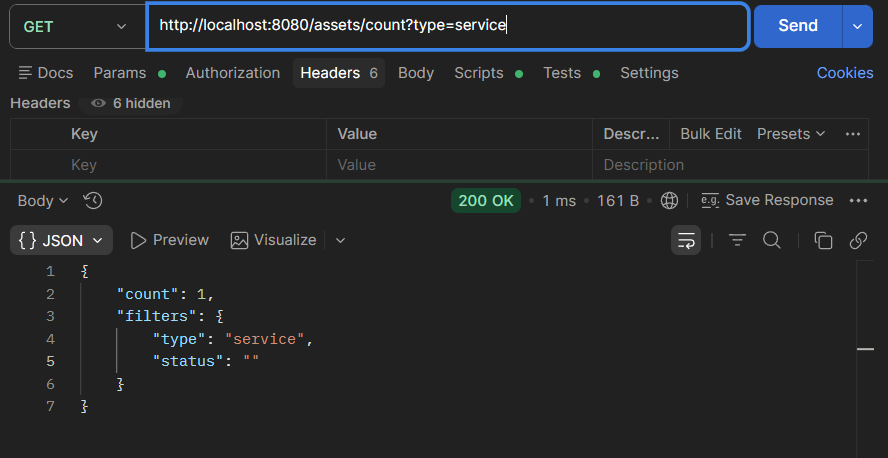

count có type và status
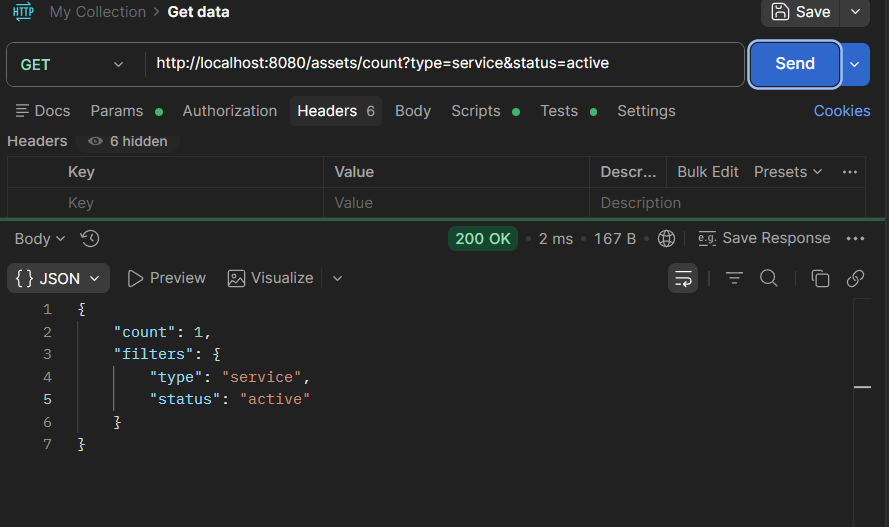
- [x] Bài 2: Batch Create
tạo được 2 thằng một lúc
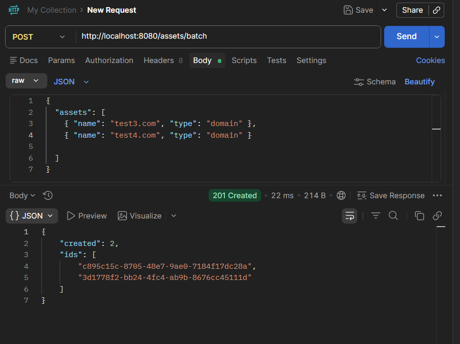

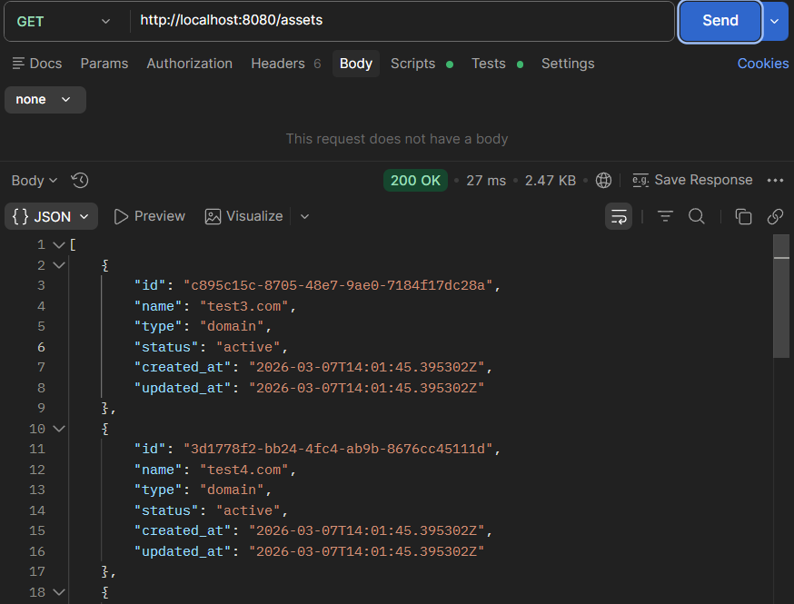

invalid domain
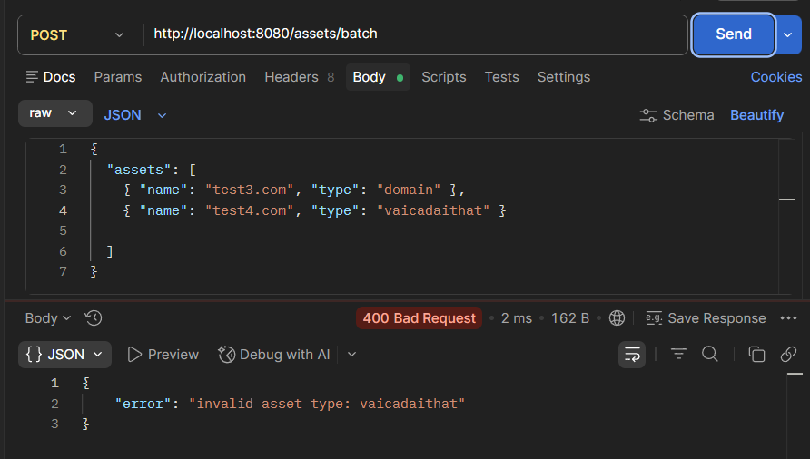

limit 100 request
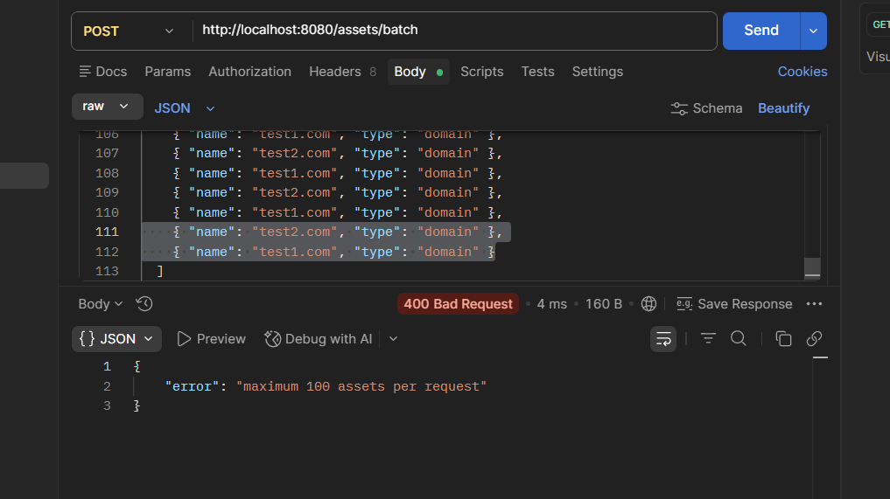
- [x] Bài 3: Batch Delete
giả sử muốn xóa 3 thằng này
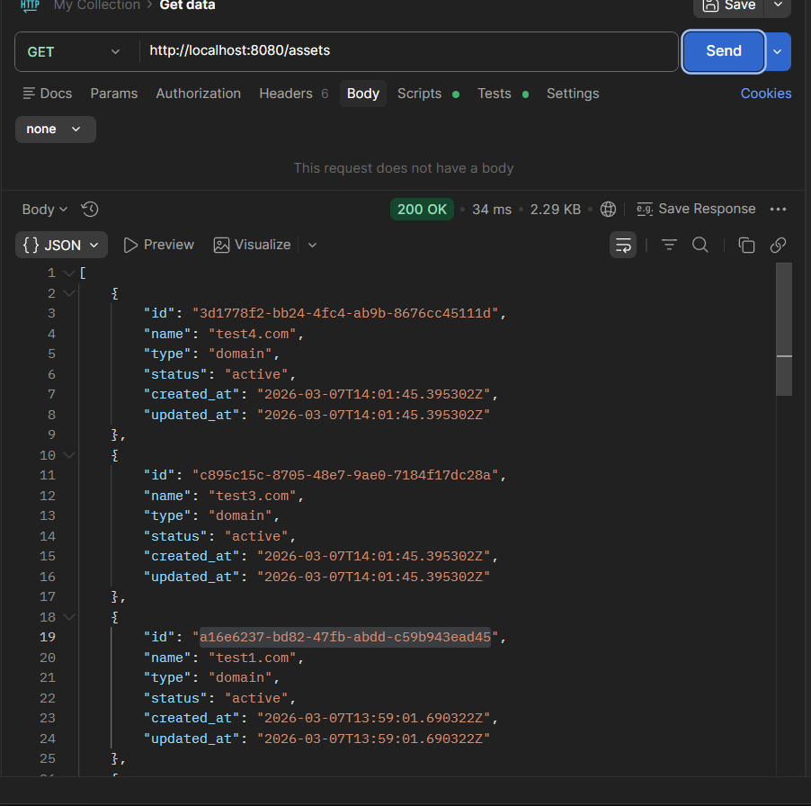

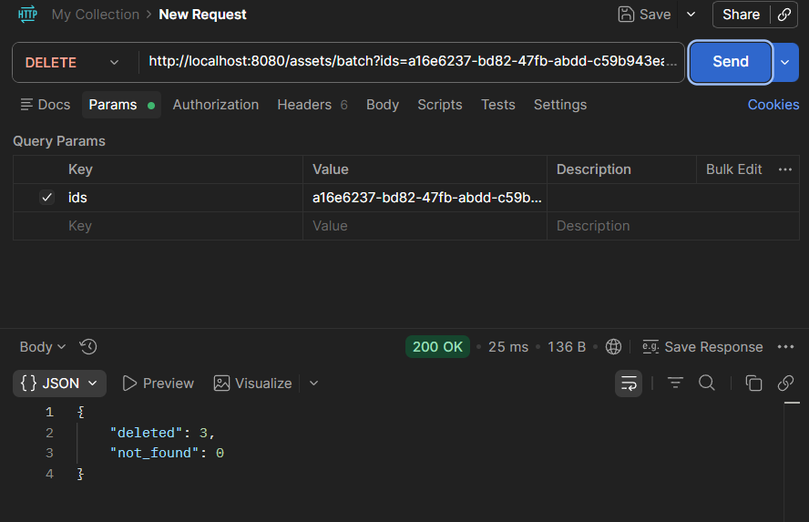

check lại -> mất
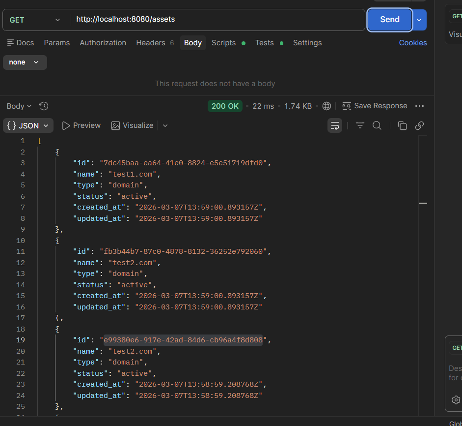

và xóa lại 3 thằng bên trên -> not found
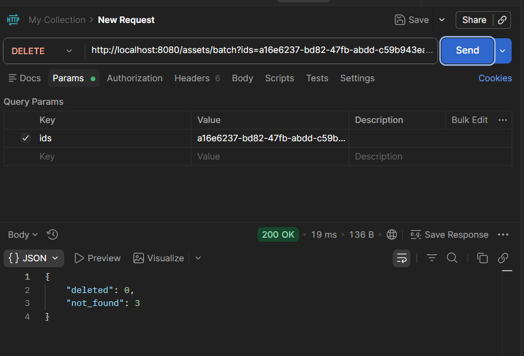

- [x] Bài 4: Connection Retry

nếu db chưa bật
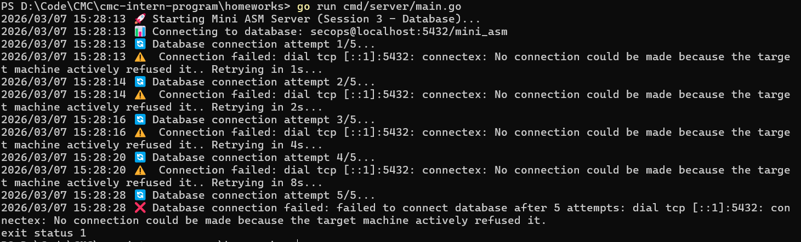

trong quá trình retry thì bật db lên
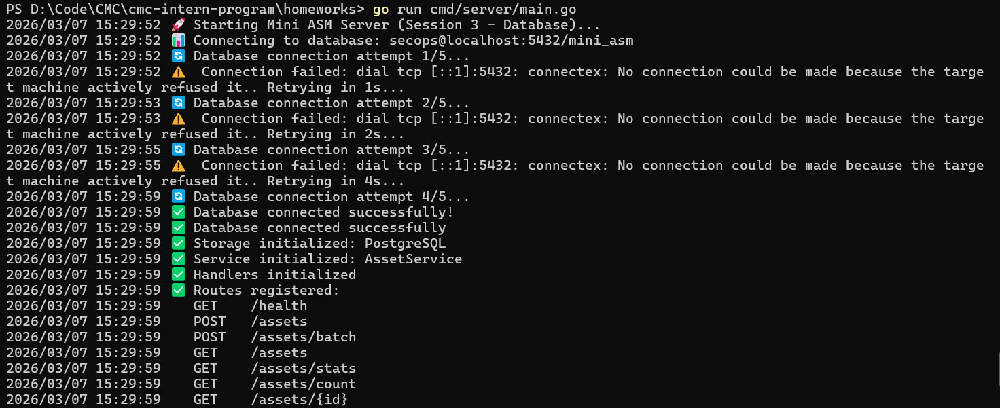

- [x] Bài 5: Health Check
db up
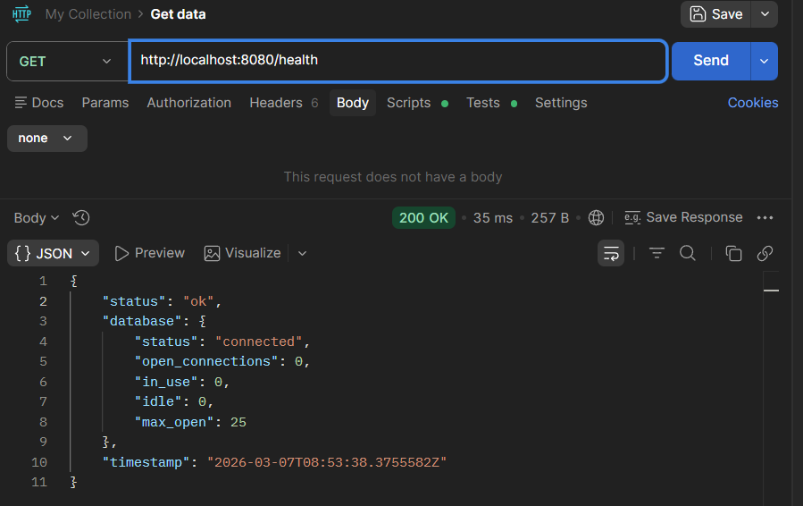

db down
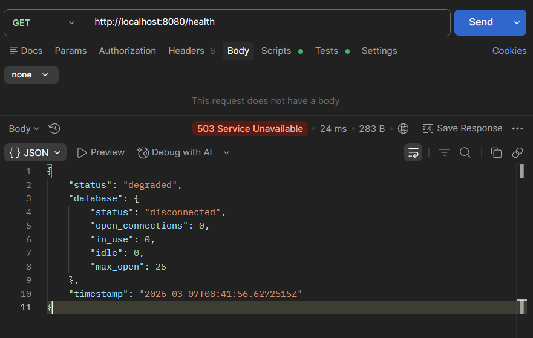

Vì db.Stats() lấy thông tin từ connection pool của sql.DB trong app, không phải query trực tiếp xuống DB. Còn db.Ping() mới là cái check DB có thật sự reachable không.

Lấy stats := db.Stats(), rồi Ping() để quyết định 200 hay 503
- [ ] Bài 6: Pagination (Bonus)
- [x] Bài 7: Search (Bonus)

Nếu tồn tại
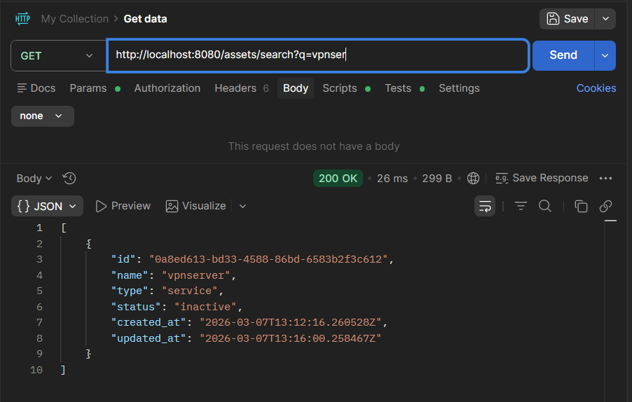

Nếu không tồn tại 
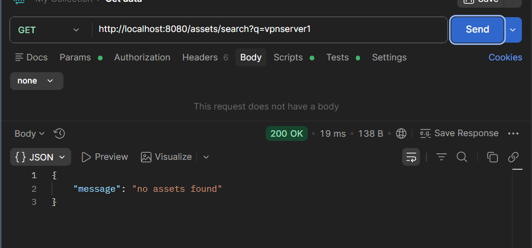